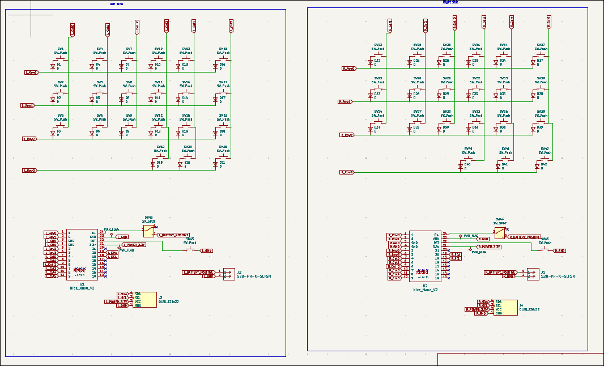
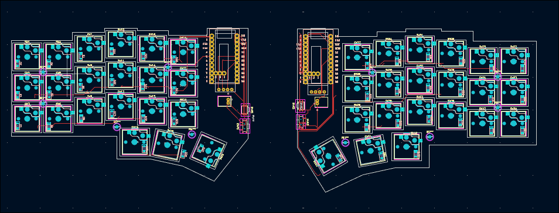

# OMEGA

### total hours spent: 16hr

## Day 1 - May 22nd

time spent: 0.5

Today is the first day of starting the split keyboard project, named the "Omega Grid". For this keyboard, my whole goal is to add features that I find missing in my current keyboard. I've made a list of things the Omega needs to have for it to be the "perfect" keyboard for me.

Features:
* A slim keyboard, with low profile switches
* A Wireless split keyboard
* Orttholinear layout
* Unique designs
* Hot swabable

## Day 2 - May 30th

time spent: 0.5 hrs

Now that I know what features I want in my keyboard, I need to know what parts of the keyboard I need to make these features real.

**MCU**: I see lots of recommendations for the **nice!nano v2**. And there's reasons for it. Its super slimm, which fits for my Slim keyboard and it has the nRF52840 chip which is good for bluetooth. In addition, it supports **ZMK** which I will use for my firmware.

**Screen**: For my screen on my keyboard, I will use the **nice!view**. Yes this is a bit expensive but honestly worth it. Its 30hz, draws low power (big win for wireless keyboards), and decent display.

**Switches**: Choosing my switches wasn't hard, I chose the **Red Kailh Low Profile Choc** Switches. They have good ergonomics, sound good, and comfortable to type on.

**Case**: My case will be 3d print, making it easy to make custom designs and cheap.

## Day 3 - July 4th

time spend: 5hrs

I just spent a lot of time on creating a budget and doing more research on the parts I chose in day 2. So I have only change.
I need to remove the screen from my project. This is because the nice!view is way too expensive and I rather just save up for a
nice!view later on when I have the keyboard intead of using a cheap oled.

### Budget
| Item              | Price (USD) |
|-------------------|--------------|
| Nice!Nano         | $51.10       |
| Lithium Battery   | $8.76        |
| Solder Sockets    | $14.60       |
| PCB (idk price)   | $21.90       |
| 3D printed case   | $5.11        |
| Switches          | $12.64       |
| KeyCaps           | $21.90       |
| Diodes            | $1.01        |
| Kalih Hotswaps    | $1.01        |
| Power Switch      | $2.19        |
| Reset Button      | $2.19        |
| Battery Jack      | $1.46        |
| Screws Kits       | $3.23        |

In addition, I also did my schematics:

### Day 4,5,6 - June 5th - 7th

time spent: 10hrs

After reflecting more about my componenet choices on day 3, I choose to use a normal 128x32 oled screen from aliexpress instead of a nice!view since I still really want a display but dont want to pay that much. In addition, I have tweaked a bit of things in the budget like alternating some of my items to aliexpress (solder sockets, etc). For these 3 days, I have been focusing on building my pcb and schematics and having a efficient pcb which suits my needs. I've also done lots of research of how I was going to make the layout of my pcb. A great source that helped me was the this [repo](https://github.com/foostan/crkbd/?tab=readme-ov-file) with a great diagram here:

My current building status for my pcb and schematics are not 100% finished but they are mostly finished I would say. Here is the progress:

Schematics:

PCB:

