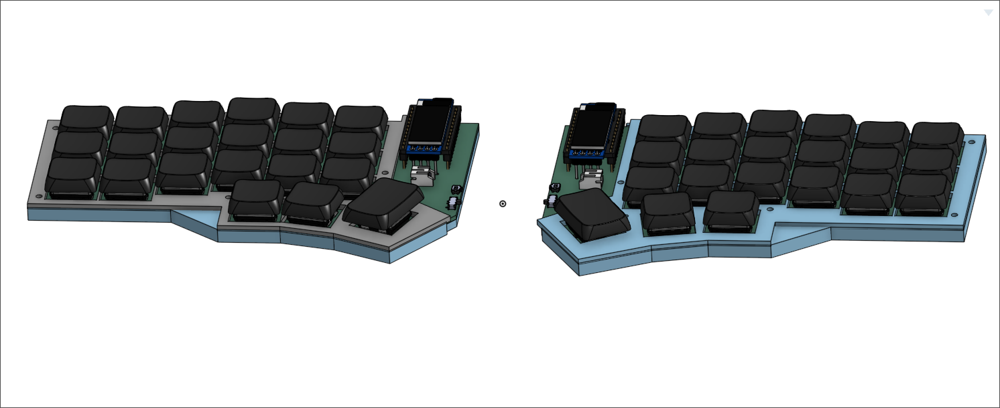
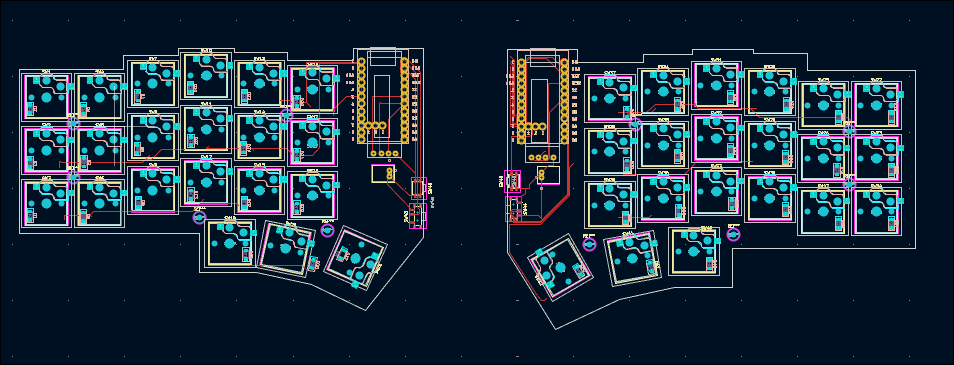
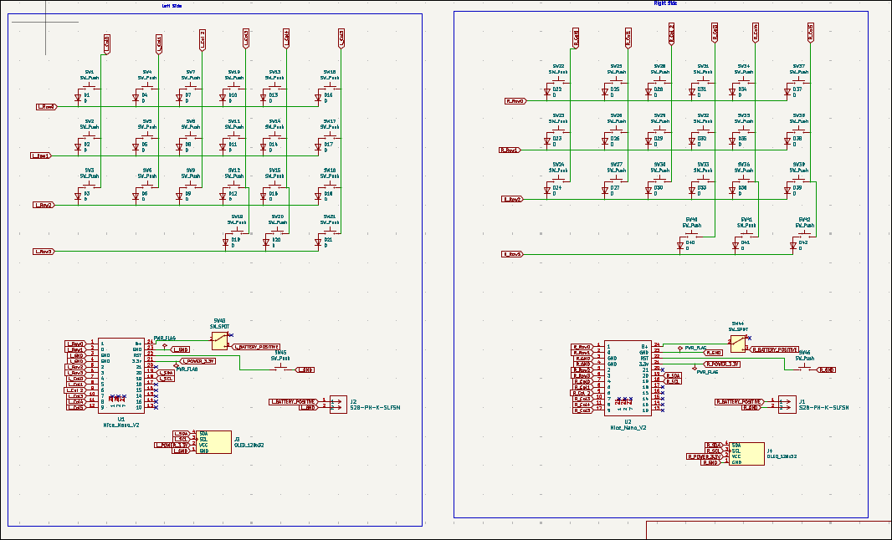

# Omega

### Description:

Omega is an open source corne wireless keyboard that is built with the nice!nano v2. It includes an oled screen for each side and a low profile look. It looks great and great for coders, writers and any person who uses there keyboards a lot. In addition, Omega is built with the firmware called ZMK to allow bluetooth pairing.

### Why did I even make this:

A big reason why I started making this is because a problem I had with modern keyboards. They are not ergonomic and can be very damaging to someones wrists if they are typing for a long time. And since I am a coder who uses their keyboard a lot (i use vim), I face this problem.

Full 3d model of Omega

PCB:

Schematics:

|Name                  |Qty |Final Price- USD                |Link                                                    |
|----------------------|----|--------------------------------|--------------------------------------------------------|
|ProMicro              | 2  | 5.72                           | https://www.aliexpress.us/item/1005001621678794.html   |
|Lithium Battery 110mAh| 2  | 5.77                           | https://www.aliexpress.com/item/1005005348368664.html  |
|Machine Sockets       | 1  | 2.83                           | https://www.aliexpress.com/item/4001122376295.html     |
|Machine Pins          | 1  | 3.99                           | https://www.aliexpress.com/item/32858430771.html       |
|PCB                   | 2  | ~15.00 (including $20 discount & shipping) | https://jlcpcb.com/                        |
|3d printed case       | 2  | 10.00                          | printing locally                                       |
|OLED                  | 2  | 6.94                           | https://www.aliexpress.us/item/1005005301005280.html   |
|Choc Switches         | 50 | 25.00                          | https://www.aliexpress.com/item/1005008883418065.html  |
|choc keycaps          | 42 | 5.00                           | gonna print them locally                               |
|SMD diodes            | 100| 2.08                           | https://www.aliexpress.com/item/1005004629414782.html  |
|Kalih Hotswaps        | 50 | 6.85                           | https://www.aliexpress.com/item/1005008543325730.html  |
|Power Switch          | 5  | 0.69                           | https://lcsc.com/product-detail/image/SSSS811101_C109335.html |
|Reset Button          | 5  | 0.17                           | https://lcsc.com/product-detail/Tactile-Switches_G-Switch-GT-TC041B-H036-L1N_C2686893.html          |
|Battery Jack          | 5  | 0.71                           | https://lcsc.com/product-detail/image/S2B-PH-K-S-LF-SN_C173752.html          |
|Screw Kit             | 1  | 3.26                           | https://www.aliexpress.com/item/1005008459241647.html  |
|Shipement & other fees|    | 29.52                          | n/a                                                    |
|Total                 |    | 123.53                         |                                                        |