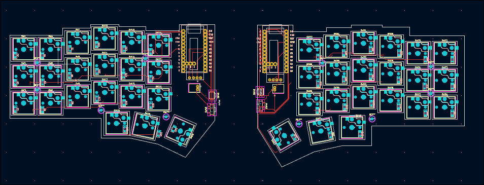
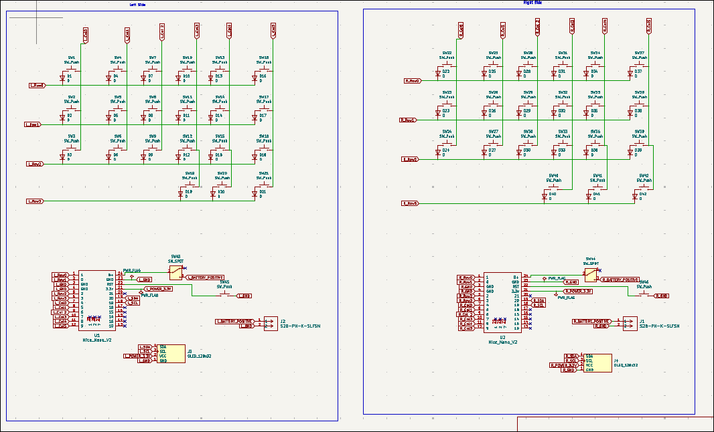

# Omega

### Description:

Omega is an open source corne wireless keyboard that is built with the nice!nano v2. It includes an oled screen for each side and a low profile look. It looks great and great for coders, writers and any person who uses there keyboards a lot. In addition, Omega is built with the firmware called ZMK to allow bluetooth pairing.

### Why did I even make this:

A big reason why I started making this is because a problem I had with modern keyboards. They are not ergonomic and can be very damaging to someones wrists if they are typing for a long time. And since I am a coder who uses their keyboard a lot (i use vim), I face this problem.

Full 3d model of Omega

PCB:

Schematics:

|Name                  |Qty |Final Price- USD                |Link                                                    |
|----------------------|----|--------------------------------|--------------------------------------------------------|
|Nice!nano             | 2  | 51.1                           | https://typeractive.xyz/products/nice-nano             |
|Lithium Battery 110mAh| 2  | 4.38                           | https://typeractive.xyz/products/lithium-battery-110mah|
|Machine Sockets       | 1  | 2.83                           | https://www.aliexpress.com/item/4001122376295.html     |
|Machine Pins          | 1  | 3.99                           | https://www.aliexpress.com/item/32858430771.html       |
|PCB                   | 2  | ~30.00 (including $20 discount)| https://jlcpcb.com/                                    |
|3d printed case       | 2  | ~10.00                         | n/a                                                    |
|OLED                  | 2  | 7.98                           | https://www.aliexpress.us/item/1005005301005280.html   |
|Choc Switches         | 50 | 12.00                          | https://www.aliexpress.com/item/1005008883418065.html  |
|1u keycaps            | 40 | 14.61                          | https://typeractive.xyz/products/mbk-keycaps           |
|1.5u keycaps          | 2  | 4.38                           | https://typeractive.xyz/products/mbk-keycaps           |
|SMD diodes            | 100| 2.07                           | https://www.aliexpress.com/item/1005004629414782.html  |
|Kalih Hotswaps        | 50 | 6.58                           | https://www.aliexpress.com/item/1005008543325730.html  |
|Power Switch          | 2  | 2.19                           | https://typeractive.xyz/products/power-switch          |
|Reset Button          | 2  | 2.19                           | https://typeractive.xyz/products/reset-button          |
|Battery Jack          | 2  | 1.46                           | https://typeractive.xyz/products/battery-jack          |
|Screw Kit             | 1  | 1.00                           | https://www.aliexpress.com/item/1005008459241647.html  |
|Total                 |    | 156.75                         |                                                        |

